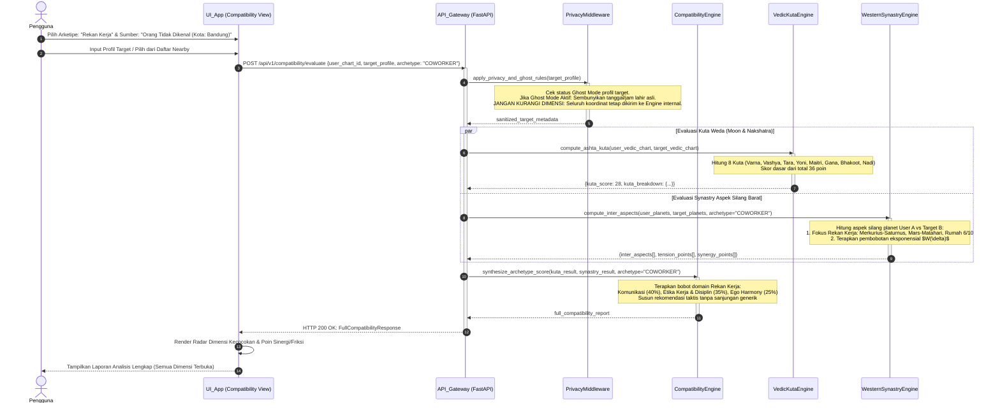

# Sequence Diagram 04: Evaluasi Kecocokan Multi-Arketipe & Profil Orang Asing

**ID Dokumen:** SD-ASTRO-004  
**Fitur Terkait:** Fitur 9 (Kecocokan Multi-Relasi), Fitur 10 (Kontrol Privasi & Ghost Mode)  
**Status:** Disetujui  

---

## 1. Deskripsi Skenario

Diagram ini memodelkan alur evaluasi kecocokan (*synastry*) antar dua profil:
1. Pengguna memilih salah satu dari 3 arketipe relasi: **Pasangan (Romantis)**, **Teman (Sosial)**, atau **Rekan Kerja (Profesional/Bisnis)**.
2. Pengguna memilih sumber profil target: dari Kontak Telepon, Pengguna di Sekitar (*Nearby Proximity*), atau **Profil Orang Tidak Dikenal (*Stranger Profile*)**.
3. Sistem menerapkan aturan **Ghost Mode & Privasi**: jika profil target menyalakan penyamaran, data mentah jam dan tanggal lahir dimasking, namun **seluruh dimensi dan metrik kecocokan tetap dihitung dan disajikan secara utuh tanpa reduksi** (mandat eksplisit).
4. *CompatibilityEngine* mengomputasi aspek inter-chart Barat, skor Ashta Kuta Weda (36 poin), dan matriks sinergi spesifik arketipe (e.g. Merkurius-Saturnus untuk rekan kerja).

---

## 2. Partisipan Sistem

* **Pengguna (User):** Aktor yang memulai pengecekan kecocokan.
* **UI_App (Expo React Native):** Komponen `CompatibilityMatrix` dan pemilih sumber profil.
* **API_Gateway (FastAPI):** Endpoint `/api/v1/compatibility/evaluate`.
* **PrivacyMiddleware:** Penegak aturan privasi, masking koordinat, dan validasi izin *Ghost Mode*.
* **CompatibilityEngine:** Engine multi-dimensi yang menghitung synastry aspek silang dan kuta.
* **VedicKutaEngine:** Komputator 8 Kuta tradisi Weda (Varna, Vashya, Tara, Yoni, Graha Maitri, Gana, Bhakoot, Nadi).
* **WesternSynastryEngine:** Komputator inter-aspects antar-chart dengan pembobotan eksponensial.

---

## 3. Sequence Diagram (Mermaid)



---

## 4. Penanganan Kasus Khusus (*Edge Cases*)

| Kasus Khusus | Risiko | Mekanisme Penanganan |
| :--- | :--- | :--- |
| **Profil Orang Asing Tanpa Jam Lahir Pasti** | Ascendant dan batas rumah profil target tidak diketahui secara definitif. | Gunakan posisi zodiak berbasis zodiak surya (*Chandra Lagna / Surya Lagna*) sebagai referensi rumah sekunder, dengan penanda diagnostik transparansi bahwa evaluasi rumah adalah aproksimasi bulan. |
| **Penyalahgunaan Data Lokasi Pengguna (*Stalking*)** | Pengguna memanfaatkan fitur *Nearby* untuk melacak lokasi presisi orang lain. | Koordinat lokasi fisik dikaburkan (*geohash jitter*) dengan radius minimal 500 meter; alamat fisik tidak pernah disiarkan. |
| **Bias Arketipe Romantis Terbawa ke Rekan Kerja** | Algoritma memberikan saran romantis yang tidak relevan di lingkungan kantor. | Isolasi formula pembobotan arketipe: pada arketipe Rekan Kerja, aspek Venus-Mars dinolkan bobotnya dan difokuskan murni pada aspek Merkurius-Saturnus-Mars-Jupiter. |

---

## 5. Struktur Kontrak Data (Contoh Ringkas)

### Request: `POST /api/v1/compatibility/evaluate`
```json
{
  "user_chart_id": "c7a84091-28cf-4351-b8d1-580a6b7d532a",
  "target_type": "STRANGER",
  "target_payload": {
    "city_name": "Bandung",
    "approximate_date": "2005-03-15",
    "is_ghost_mode": true
  },
  "archetype": "COWORKER"
}
```

### Response: `HTTP 200 OK`
```json
{
  "status": "success",
  "archetype": "COWORKER",
  "profile_display": {
    "alias": "Anonymous User (Bandung)",
    "birth_details_masked": true
  },
  "overall_score": 78,
  "dimensions": {
    "communication_flow": {"score": 85, "verdict": "High Rapport (Mercury Trine Mercury)"},
    "work_ethic_discipline": {"score": 72, "verdict": "Structured (Saturn Sextile Mars)"},
    "ego_and_leadership": {"score": 68, "verdict": "Moderate Friction (Sun Square Mars)"}
  },
  "vedic_ashta_kuta": {
    "total_points": 26,
    "max_points": 36,
    "graha_maitri": 5,
    "gana_kuta": 6
  },
  "actionable_guidance": "Gaya komunikasi sangat produktif dan cepat menemukan solusi konseptual. Perhatikan delegasi tugas kepemimpinan untuk menghindari benturan ego saat tenggat waktu ketat."
}
```
