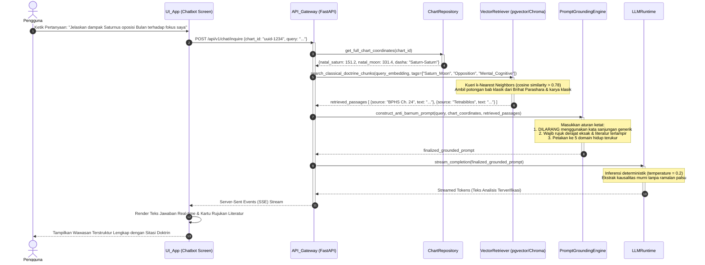

# Sequence Diagram 05: Konsultasi Doktrin AI Chatbot RAG

**ID Dokumen:** SD-ASTRO-005  
**Fitur Terkait:** Fitur 11 (Chatbot AI Berbasis RAG)  
**Status:** Disetujui  

---

## 1. Deskripsi Skenario

Diagram ini memodelkan alur kerja sistem AI Chatbot berbasis **RAG (Retrieval-Augmented Generation)**:
1. Pengguna mengajukan pertanyaan seputar interpretasi posisi planet atau transit (misal: *"Apa arti Saturnus di rumah ke-1 beroposisi dengan Bulan di rumah ke-7 terhadap ritme kerja dan stres saya?"*).
2. Sistem mengisolasi koordinat matematis natal pengguna dan transit yang sedang berlangsung.
3. *Vector Retrieval Service* melakukan pencarian kemiripan semantik (*semantic similarity search*) pada basis data vektor doktrin klasik terverifikasi (*Brihat Parashara Hora Shastra*, *Phaladeepika*, risalah Ptolemeus, dsb.).
4. *Prompt Assembler* merakit konteks yang memuat data astronomis presisi dan kutipan literatur klasik otoritatif ke dalam instruksi *system prompt* anti-Barnum yang ketat.
5. Mesin inferensi LLM menghasilkan penjelasan objektif berlandaskan kausalitas celestial nyata dengan **0% Halusinasi**.

---

## 2. Partisipan Sistem

* **Pengguna (User):** Aktor yang mengirimkan pertanyaan pada antarmuka chat.
* **UI_App (Expo React Native):** Komponen `RAGChatInterface` (antarmuka pesan & penampil rujukan teks).
* **API_Gateway (FastAPI):** Endpoint streaming `/api/v1/chat/inquire`.
* **ChartRepository:** Penyedia koordinat presisi bagan natal pengguna dari basis data.
* **VectorRetriever (ChromaDB / pgvector):** Mesin pencari konteks literatur klasik berbasis *embedding*.
* **PromptGroundingEngine:** Modul penyusun prompt terstruktur dengan aturan ketat penolakan ramalan generik (*Anti-Barnum Guardrails*).
* **LLMRuntime (Gemini API / Local Model):** Model bahasa besar yang menghasilkan teks inferensi akhir.

---

## 3. Sequence Diagram (Mermaid)



---

## 4. Penanganan Kasus Khusus (*Edge Cases*)

| Kasus Khusus | Risiko | Mekanisme Penanganan |
| :--- | :--- | :--- |
| **Pertanyaan di Luar Domain Astrologi (Out-of-Domain)** | LLM memberikan saran finansial/medis sembarangan. | *Guardrail Filter*: Prompt memblokir pertanyaan non-astrologi dan mengembalikan instruksi pengalihan yang netral dan aman. |
| **Upaya Menuntut Ramalan Nasib Pasti ("Kapan saya kaya?")** | Pengguna mengharapkan ramalan masa depan yang tidak bertanggung jawab. | *Barnum Rejection Handler*: Sistem secara terprogram menolak vonis takdir deterministik dan mengalihkan ke analisis siklus energi serta dinamika disiplin Saturnus. |
| **Gagal Menemukan Literatur yang Relevan (*Vector Score Rendah*)** | Halusinasi karena kekurangan konteks rujukan. | Jika skor *cosine similarity* $< 0.65$, sistem menolak berhalusinasi dan menyatakan secara transparan bahwa tidak ada doktrin klasik yang memvalidasi konfigurasi ekstrem tersebut. |

---

## 5. Struktur Kontrak Data (Contoh Ringkas)

### Request: `POST /api/v1/chat/inquire`
```json
{
  "chart_id": "c7a84091-28cf-4351-b8d1-580a6b7d532a",
  "query": "Bagaimana pengaruh aspek Saturnus oposisi Bulan natal terhadap kondisi psikologis dan fokus kerja saya?",
  "stream": true
}
```

### Response Stream: `Server-Sent Events (SSE)`
```text
event: token
data: {"text": "Secara mekanika astronomis, Saturnus berada pada 151°12' (Leo) berjarak 180°12' terhadap Bulan pada 331°24' (Aquarius)..."}

event: citation
data: {"source": "Brihat Parashara Hora Shastra, Bab Pengaruh Aspek Saturnus", "chapter": 24, "doctrine_context": "Saturnus memberi aspek pada Bulan memicu kehati-hatian berlebih, ketahanan mental di bawah tekanan..."}

event: complete
data: {"finished": true}
```
