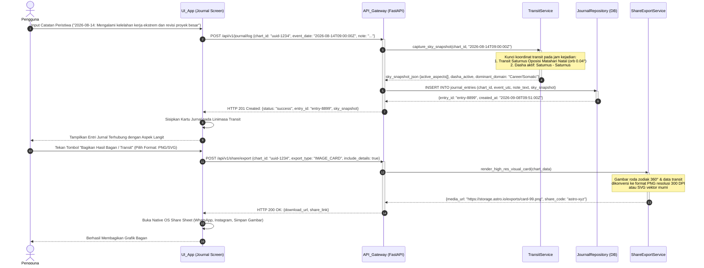

# Sequence Diagram 06: Pencatatan Jurnal Empiris & Fitur Bagikan

**ID Dokumen:** SD-ASTRO-006  
**Fitur Terkait:** Fitur 7 (Jurnal Refleksi Empiris), Fitur 8 (Fitur Bagikan / Share)  
**Status:** Disetujui  

---

## 1. Deskripsi Skenario

Diagram ini memodelkan alur pencatatan peristiwa hidup nyata oleh pengguna untuk pembuktian astrologi secara empiris:
1. Pengguna mencatat peristiwa hidup nyata pada tanggal tertentu (misal: sakit demam parah, promosi jabatan, perselisihan rekan tim).
2. Sistem secara otomatis mengunci *snapshot* konfigurasi astronomis (posisi transit, aspek aktif dengan bobot $W(\delta)$, dan siklus Dasha aktif) pada tanggal/jam tersebut.
3. Entri jurnal tersimpan permanen dan terhubung ke linimasa transit.
4. Pengguna dapat mengekspor atau membagikan grafik bagan / jurnal empiris ke media luar (format PNG/SVG atau *shareable link*).

---

## 2. Partisipan Sistem

* **Pengguna (User):** Aktor yang mencatat peristiwa harian atau membagikan bagan.
* **UI_App (Expo React Native):** Layar Jurnal Empiris & tombol Bagikan (*Share*).
* **API_Gateway (FastAPI):** Endpoint `/api/v1/journal/log` dan `/api/v1/share/export`.
* **TransitService:** Penyedia snapshot posisi langit dan aspek transit pada tanggal kejadian.
* **JournalRepository (Database):** Tabel `journal_entries` relasional PostgreSQL/SQLite.
* **ShareExportService:** Generator grafis SVG/PNG resolusi tinggi dan pembuat tautan aman.

---

## 3. Sequence Diagram (Mermaid)



---

## 4. Penanganan Kasus Khusus (*Edge Cases*)

| Kasus Khusus | Risiko | Mekanisme Penanganan |
| :--- | :--- | :--- |
| **Pencatatan Tanggal Lampau Jauh (Masa Kecil)** | Ketiadaan cache transit harian untuk tahun-tahun lampau (misal: tahun 1995). | *On-demand Ephemeris Computation*: Hitung langsung via `pyswisseph` tanpa bergantung pada cache modern. |
| **Ukuran File Ekspor Terlalu Besar** | Gagal saat dibagikan via aplikasi perpesanan. | Kompresi PNG cerdas dengan palet warna teroptimasi (maksimal 2 MB per berkas grafis). |
| **Privasi Data Catatan Jurnal Pribadi** | Catatan pribadi bocor ke publik saat tautan bagikan dibuka orang lain. | Tautan bagikan (*Shareable Link*) secara bawaan memisahkan dan memblokir teks jurnal pribadi; hanya grafik geometri astronomis yang diekspor ke publik. |

---

## 5. Struktur Kontrak Data (Contoh Ringkas)

### Request: `POST /api/v1/journal/log`
```json
{
  "chart_id": "c7a84091-28cf-4351-b8d1-580a6b7d532a",
  "event_date": "2026-08-14T09:00:00Z",
  "note": "Mengalami kelelahan fisik luar biasa dan diminta merestrukturisasi seluruh tim.",
  "subjective_tags": ["Work", "Fatigue", "Restructure"]
}
```

### Response: `HTTP 201 Created`
```json
{
  "status": "success",
  "entry_id": "8b9e6c2d-88f1-432a-bc91-912837264819",
  "anchored_astronomy": {
    "target_utc": "2026-08-14T09:00:00Z",
    "primary_transit": "Saturn Opposition Sun (Orb 0.04°)",
    "active_dasha": "Saturn-Saturn",
    "affected_domains": ["Career/Situational", "Somatic/Physiological"]
  }
}
```
