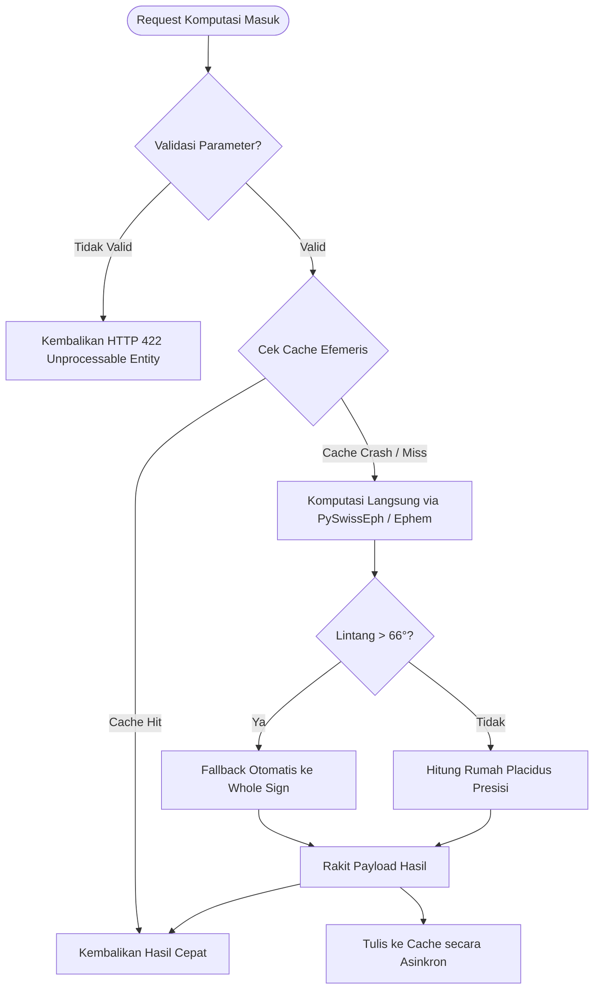

# Dokumen Desain Teknis (TDD) - Bagian 4: Penanganan Kegagalan (Fault Tolerance & Resilience)

**ID Dokumen:** TDD-ASTRO-004  
**Versi:** 1.0.0  
**Status:** Disetujui  
**Referensi:** PRD-ASTRO-001, ADR 0001–0008  

---

## 1. Filosofi Ketahanan Sistem (*Resilience Philosophy*)

Sistem **Astrology-Interpreter** mengadopsi prinsip **Graceful Degradation** dan **Zero Single Point of Failure (SPOF)**. Kegagalan pada komponen eksternal (seperti server LLM atau layanan notifikasi) tidak boleh menghentikan fungsionalitas inti komputasi matematika astronomis.

---

## 2. Taksonomi Kegagalan & Matriks Mitigasi

| Domain Kegagalan | Modus Kegagalan | Dampak | Pola Penanganan (*Mitigation Pattern*) |
| :--- | :--- | :---: | :--- |
| **Ephemeris Engine** | Singularitas trigonometri pada lintang ekstrem ($>66^\circ$) saat menghitung rumah Placidus. | Sedang | *Automatic House Fallback*: Jika pembagian Placidus gagal (titik potong horizon paralel), sistem otomatis beralih ke *Whole Sign* dengan kode status `DEGRADED_HOUSE_FALLBACK` dan pesan diagnostik. |
| **Ephemeris Engine** | Rentang tanggal di luar jangkauan efemeris Swiss Ephemeris ($< 5401\text{ SM}$ atau $> 5402\text{ M}$). | Tinggi | *Input Boundary Guard*: Validator Pydantic membatasi input tanggal antara tahun 1800 s.d. 2100 untuk presisi terjamin ($0.001^\circ$). |
| **Geospatial & Time** | Koordinat berada di lautan lepas tanpa poligon IANA resmi (`timezonefinder` mengembalikan `None`). | Rendah | *Nautical Timezone Fallback*: Hitung zona waktu maritim berbasis bujur: $\text{Offset} = \text{round}(Lon / 15^\circ)$, format `Etc/GMT[±X]`. |
| **Geospatial & Time** | Ambiguitas waktu sipil saat jam dimundurkan 1 jam pada transisi DST. | Sedang | *Deterministic DST Disambiguation*: Gunakan parameter `fold=0` secara default (waktu sebelum transisi) dan sediakan flag `is_dst_fold` jika pengguna ingin memilih waktu pasca-transisi. |
| **Caching Layer** | Redis / In-Memory Cache Crash atau Kehabisan Memori. | Rendah | *Fail-Safe Bypass*: Sistem menangkap error koneksi cache dan langsung mengeksekusi komputasi astronomis murni *in-process*. Latensi naik 20ms, tetapi layanan tetap 100% aktif. |
| **Database RDBMS** | Koneksi PostgreSQL jenuh (*Connection Pool Exhaustion*). | Tinggi | *Connection Pooler & Circuit Breaker*: SQLAlchemy diatur dengan pool size 20, max overflow 30. Gunakan PgBouncer untuk multiplexing koneksi. |
| **AI RAG Pipeline** | Provider LLM mengalami Rate Limit (HTTP 429) atau Timeout (HTTP 504). | Sedang | *Exponential Backoff & Fallback Engine*: Retry 3 kali dengan jitter ($1\text{s}, 2\text{s}, 4\text{s}$). Jika tetap gagal, beralih ke engine aforisma klasik statis (*Deterministic Doctrine Fallback*). |
| **AI RAG Pipeline** | Skor kemiripan vektor Doktrin Klasik rendah ($< 0.65$). | Kritis | *Anti-Hallucination Guardrail*: Sistem secara terprogram menolak berspekulasi dan mengembalikan pesan bahwa tidak ada literatur klasik yang memvalidasi konfigurasi tersebut. |
| **Push Notification** | Token FCM/APNs kedaluwarsa atau pengguna mencopot aplikasi. | Rendah | *Stale Token Deactivation*: Worker menangkap error `UNREGISTERED` dan langsung menandai `is_active=false` pada tabel token pengguna. |

---

## 3. Pola Arsitektur Ketahanan Teknis

---

## 4. Pemulihan Bencana & Integritas Data (*Disaster Recovery*)

1. **Strategi Cadangan Basis Data (Database Backups):**
   * *Point-In-Time Recovery (PITR)* menggunakan Write-Ahead Logs (WAL) PostgreSQL yang diunggah ke storage terpisah setiap 10 menit.
   * *Daily Full Snapshot* dieksekusi setiap pukul 02:00 UTC dengan retensi 30 hari.
2. **Health Check & Self-Healing Endpoint:**
   * `/healthz/live`: Memastikan proses ASGI FastAPI berjalan.
   * `/healthz/ready`: Memverifikasi koneksi PostgreSQL, file efemeris Swiss Ephemeris (`.se1`), dan indeks Vector DB.
   * Orkestrasi Docker / Kubernetes secara otomatis me-restart container jika endpoint liveness gagal 3 kali berturut-turut.
