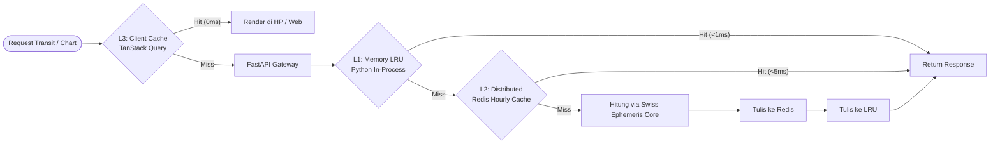

# Dokumen Desain Teknis (TDD) - Bagian 5: Skalabilitas & Kinerja Sistem

**ID Dokumen:** TDD-ASTRO-005  
**Versi:** 1.0.0  
**Status:** Disetujui  
**Referensi:** PRD-ASTRO-001, ADR 0001–0008  

---

## 1. Profil Beban Kerja Komputasi (*Workload Profile*)

Karakteristik sistem komputasi astrologi terbagi menjadi tiga profil beban utama:
1. **CPU-Bound (Komputasi Ephemeris & Aspek):** Kalkulasi posisi planet, interpolasi bisection pada *Aspect Hit Scanner*, dan proyeksi rumah Placidus menuntut operasi floating-point intensif.
2. **I/O-Bound (AI RAG & Notifikasi):** Pengambilan dokumen vektor doktrin klasik dan pengiriman ribuan push notification transit harian.
3. **Memory-Bound (Kueri Geospasial Luring):** Struktur pohon poligon biner `timezonefinder` disimpan langsung dalam RAM proses server untuk menjamin latensi $\le 10\text{ ms}$.

---

## 2. Strategi Caching 3-Tingkat (*3-Tier Caching Architecture*)

Untuk memastikan latensi API tetap di bawah $150\text{ ms}$ bahkan saat melayani jutaan pengguna, sistem mengimplementasikan arsitektur *caching* berlapis:

* **Level 1 (In-Process LRU Cache):**
  Menggunakan `functools.lru_cache(maxsize=16384)` untuk menyimpan konstanta Julian Date, nilai presesi Ayanamsha tahunan, dan vektor trigonometri sudut dasar.
* **Level 2 (Distributed Redis Cache - ADR-0006):**
  Menyimpan blok posisi langit per jam diskrit (*Hourly Discrete Ephemeris*). Satu tahun kalender penuh hanya membutuhkan:
  $$365.25 \times 24 = 8,766 \text{ jam} \times 1\text{ KB} \approx 8.76\text{ MB RAM}$$
  Seluruh data astronomis abad ke-21 (2000–2100) dapat disimpan permanen dalam memori Redis sebesar $\sim 876\text{ MB}$.
* **Level 3 (Client-Side Persistent Cache):**
  TanStack Query pada aplikasi Expo menyimpan hasil kalkulasi natal secara lokal di penyimpanan perangkat pengguna dengan *staleTime* tak terbatas (*immutable data*), meniadakan pemanggilan ulang API untuk bagan yang sudah disimpan.

---

## 3. Skalabilitas Horizontal & Statelessness

1. **Stateless Compute Nodes:**
   Node worker FastAPI tidak menyimpan state sesi (*session state*). Setiap request membawa parameter lengkap atau merujuk pada `chart_id`. Node komputasi dapat ditambah (*scale out*) secara otomatis menggunakan Kubernetes Horizontal Pod Autoscaler (HPA) berdasarkan metrik utilisasi CPU ($>70\%$).
2. **Proses Worker Tuning:**
   Setiap kontainer FastAPI dijalankan menggunakan Uvicorn worker di belakang Gunicorn dengan formula standar:
   $$\text{Workers} = (2 \times \text{vCPU}) + 1$$
3. **Pemisahan Task Latar Belakang (Background Job Isolation):**
   * Pengecekan *Smart Transit Alerts* harian dan kalkulasi massal dipisahkan dari server API utama, didelegasikan ke worker terpisah (Celery / ARQ dengan broker Redis) agar tidak membebani latensi endpoint interaktif pengguna.

---

## 4. Optimasi & Partisi Basis Data (*Database Scaling*)

1. **Partisi Rentang Waktu (Range Partitioning):**
   Tabel `journal_entries` dan log pengiriman notifikasi dipartisi berdasarkan tahun (`PARTITION BY RANGE (event_utc)`), menjaga ukuran indeks B-Tree tetap kecil dan waktu kueri tetap konstan $O(\log N)$.
2. **Pencarian Spasial Pengguna Terdekat (Nearby Search):**
   Menggunakan indeks **PostGIS GIST** pada kolom `geom_point` untuk fitur pengguna di sekitar (*Nearby*), memungkinkan kueri radius $\le 5\text{ km}$ selesai dalam waktu $\le 5\text{ ms}$.
3. **Pemisahan Baca/Tulis (Read Replicas):**
   Kueri linimasa transit dan jurnal yang berat dialihkan ke *PostgreSQL Read Replicas*, menjaga node *Primary* tetap optimal menangani penulisan data profil baru.
